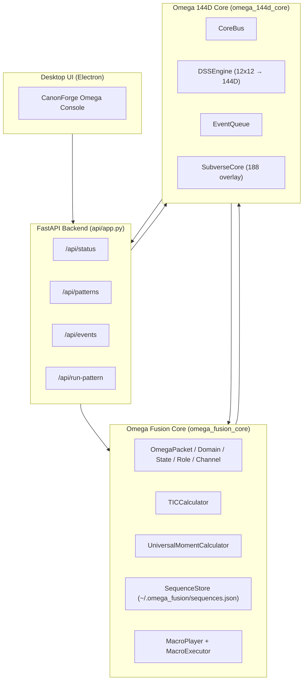
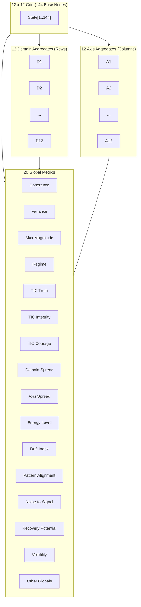

# CanonForge Omega — The First Cognitive Operating System

**Tagline:** Intent Engine · 144D Coherence Physics · Executable Behavioral Patterns  
**Author:** Jeffrey Alan Dewey

CanonForge Omega (Ω-OS) is a new class of operating system that fuses:

- A **Fusion Core** that understands human moments, roles, and TIC (Truth · Integrity · Courage)
- A **144D Deep System Symmetry engine** that measures coherence / drift across a 12×12 grid
- An **Executable Pattern OS** that can replay optimized behavioral sequences
- A **Desktop Console** (FastAPI + Electron) for live visualization and control

This repository is the investor-ready, fully wired prototype of CanonForge Omega.

---

## 🔧 Repository Layout

```text
canonforge-omega/
├── pyproject.toml          # Python project metadata (FastAPI backend)
├── README.md               # This file – high-level overview
├── LICENSE                 # MIT license (open-core)
│
├── omega_fusion_core/      # Human-intent & TIC layer
│   ├── core/
│   │   ├── model.py
│   │   ├── tic.py
│   │   └── universal_moment.py
│   ├── storage/
│   │   └── sequence_store.py
│   ├── pattern_hub/
│   │   └── macro_playback.py
│   └── host/
│       ├── muscles.py
│       └── executor.py
│
├── omega_144d_core/        # 12×12 → 144D coherence engine
│   ├── rc144_core.py
│   ├── dss_engine.py
│   ├── event_queue.py
│   ├── core_bus.py
│   └── subverse_core.py
│
├── api/
│   └── app.py              # FastAPI backend (status, patterns, events)
│
├── desktop_ui/
│   └── electron/
│       ├── package.json
│       ├── main.js
│       └── README.md       # Original Desktop UI instructions
│
├── docs/                   # (placeholder for whitepapers)
├── data/                   # (placeholder for SPY proof, etc.)
└── examples/
    └── omega144_example.py
```

---

## 🚀 Quickstart

### 1. Install & run backend

```bash
pip install -e .
uvicorn api.app:app --reload
```

### 2. Run the CanonForge Omega Desktop Console

```bash
cd desktop_ui/electron
npm install
npm start
```

### 3. Test the 144D engine

```bash
python examples/omega144_example.py
```

You should see timesteps, coherence scores, and regime labels (COHERENT / STABILIZING / DRIFT / CHAOTIC).

---

## 🧠 Core Concept

CanonForge Omega is built around three interacting layers:

1. **Fusion Core** — understands *who* you are in the moment (domain, role, channel, TIC).
2. **144D Coherence Core** — understands *how stable* your system is across a 12×12 symmetry grid.
3. **Pattern OS** — understands *what to do next* by executing stored, named behavioral sequences.

Together, these layers form a **Cognitive Operating System** designed for performance, alignment, and long-horizon coherence.

---

## 📜 License

This project is released under the MIT License – see `LICENSE` for details.

## Architecture Diagram

## Architecture Diagram



